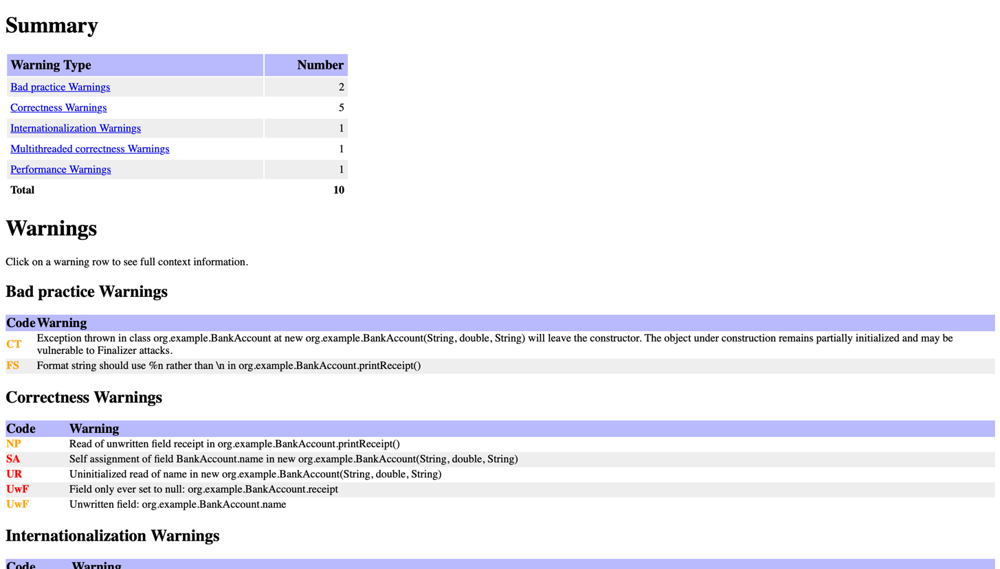

# Part 1 Defect Report 

## Program File
app/src/main/java/org/example/BankAccount.java
## Output File 
app/build/reports/spotbugs/main.html (Open in Browser)
## Tool Versions 
-Java Version: 25.0.2 (Any version 17 or above should work)
-Spot bugs version: 6.0.8
## Run Instructions
1. Use a Java Virtual Machine version over 17 (I faced some difficulties doing this due to Java 11 version being installed)
2. Run the following gradle command to run SpotBugs: ./gradlew clean spotBugsMain (I had to use a varied version of this command to explicitly use the version of JVM installed on my system - explicitly I used this: './gradlew clean spotbugsMain -Dorg.gradle.java.home="/opt/homebrew/opt/openjdk"' The last part needs to be the path your updated JDK is installed)
3. The more reliable way to run that I have found is by running it from the gradle UI and running the task: spotBugsMain
3. Upon a successful build, a main.html file will be produced in the following file: app/build/reports/spotbugs
4. Open this file in the browser
## Understanding the Results
The main.html file should contain a detailed entry of the SpotBugs Analysis report including the type of warning flagged. . As seen in the 
above image, each error can be clicked to observe the root cause of the error and where it is occurring 

## #1: CT_CONSTRUCTOR_THROW 
### Type of bug
Bad Practice
### Reason for bug 
The constructor throws an Exception and is therefore vulnerable to Finalizer attacks
### Bug-Causing code
Line 18 in BankAccount.java
### Bug analysis 
This bug stems from the fact that the constructor would throw an exception if the name provided is null which exposes the 
program to finalizer attacks. Essentially, if a null name parameter is provided to the Analyzer class instantiation, an exception would 
be thrown. A fix would be in order to prevent finalizer attacks, however, would not directly break the program as is currently. 
### Code Fix
```java
    public final class BankAccount{
    }

```

## Bug 2: UWF_NULL_FIELD
### Type of bug
Correctness Warning
### Reason for bug
The OutputStream object created, which will later be used by a function is set to NULL on instantiation and is never modified from NULL
### Bug-Causing Code 
Line 14 in BankAccount.java
### Bug analysis
This bug is a real defect since an object that is later utilized and referenced is set to NULL and never modified. This would 
cause program failures and exceptions if it is not caught
### Code Fix
```java
// If we were trying to send the OutputStream to a file titled "receipt.txt", we could declare it with the following 
OutputStream receipt = new FileOutputStream("receipt.txt");

```


## Bug 3: DM_DEFAULT_ENCODING
### Type of bug: 
Internalization
### Reason for bug
This bug arises from a string to byte conversion that assumes the default platform encoding
### Bug-Causing Code
Line 32 in BankAccount.java
### Bug analysis
This bug is a real defect and will be noticeable when the application on different systems since different systems use different encodings. 
As a result, special characters i.e. emojis will not be represented properly. This needs to be atoned for cross-platform flexibility. 
### Code Fix
Modify the line: this.receipt.write(receiptData.getBytes()) to the following: this.receipt.write(receiptData.getBytes("UTF-8"));


## Bug 4: VO_VOLATILE_INCREMENT
### Type of bug:
Multithreaded correctness 
### Reason for bug
A volatile field, in this case, ageOfAccount was incremented 
### Bug-Causing Code
Line 37 in BankAccount.java
### Bug analysis
This bug is a defect since a volatile field is incremented which is a non-atomic operation. If the volatile field is incremented or decremented in this fashion, 
increments or decrements could be lost. 
### Code Fix 
```java
public class BankAccount{
    private int ageOfAccount; 
    
    public synchronized incrementAgeOfAccount(){
        ageOfAccount++;
    }
}
```

## Bug 5: URF_UNREAD_FIELD
### Type of bug:
Performance 
### Reason for bug
The field typeOfAccount is never read
### Bug-Causing Code
Line 22 in BankAccount.java
### Bug analysis
This bug is not necessarily a defect since the program would operate as expected however the field typeOfAccount is never read or accessed. 
As is, the program would not fail but we can remove the typeOfAccount field if we don't use it to reduce code overhead and improve code maintenance and
readability.


## Bug 6: UC_USELESS_VOID_METHOD
### Type of bug:
Dodgy Code
### Reason for bug
The function appears to not do anything functionally significant and therefore appears redundant
### Bug-Causing Code
Line 52 of BankAccount.java
### Bug analysis
This bug does not inherently point to a defect. Instead, it highlights a function that does not seem to do anything significant - This in turn could be due to a 
mistake, old code, or a real defect that went unrealized. In our case, it appears that incrementAge might have been created to increment the age of the account variable instantiated at the class level.
We already have a function that increases the ageOfAccount variable aptly and as such, this function can be deleted.


